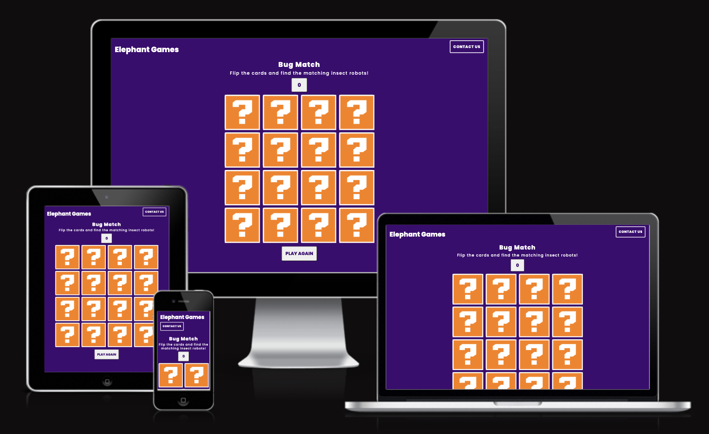

<h1 align="center">Bug Match</h1>

[View the live project here.](https://rachelfurlong-dev.github.io/bug-match-M2/)

This is a memory game for my Milestone 2 project by a fictional company called Elephant Games, designed as part of a series of memory games in different formats. The main target users are parents, who want to help their child develop working memory skills in an enjoyable way and have fun. (Child age range: 4 – 9years.)

<h2 align="center"></h2>

### User Stories:

"**_As a user, I would like to find a memory game_** _______________"

:white_check_mark: *successfully implemented*

:x: *not yet implemented*

- :white_check_mark: *my child enjoys using and to have fun*.
- :white_check_mark: *which are at the same time visually engaging and educational*.
- :white_check_mark: *with functionality that my child enjoys interacting with*.
- :white_check_mark: *which helps develop my childs memory skills in an enjoyable way*.
- :white_check_mark: *which counts the score of the matches my child gets right*.
- :white_check_mark: *which allows my child to reset the game*.
- :white_check_mark: *that develops my child's focus and concentration skills*.
- :white_check_mark: *where I can contact the creators about future games available*.
- :white_check_mark: *my child to be able to view the site* from **any device** *(mobile, tablet, desktop)*.
- :x: *which randomises the order of the cards at each reset*.
- :x: *which challenges my child with has a timer to compete against*.
- :x: *which counts the correct and incorrect matches*.
- :x: *which  has additional levels and increases the number of cards to match*.
- :x: *which rewards success as my child improves at the game*.

### Design:

#### Typography
 The Poppins font via [Google Fonts:](https://fonts.google.com/) is the main font used throughout the website with Sans Serif as the fallback font in case for any reason the font cannot be displayed in a browser correctly.

#### Color Scheme:

*Palette*: **Flip Card Memory Game**

| Cards | Background |
| :---: | :---: |
|  |  |
| #3F0270 | #3F0270 |  

### Imagery:
[Stable Diffusion](https://stablediffusionweb.com/) generated the insect robots to which I added bright colour backgrounds to make the cards easier to identify.

### Wireframes
My wireframes were created in Adobe XD as I am familiar with Adobe products and can therefore work more quickly.

Mobile 

Small-Screen 

Desktop Wireframe 

### Features

-   Create a board of 16 cards which can be flipped when clicking on the card.
-   If two selected cards match, to flip back and hidden & cannot be reselected.
-   Add a score button to show when there is a match.
-   Be able to reset the game.
-   Be able to message Game Company about more games.
-   Work on desktop and mobile screens accross browsers.

### Additional features to be implemented
-  Randomise the display of cards at reset.
-  Add a score button when cards do not match.
-  Add a timer to the game.

## Technologies Used

### Languages Used

-   [HTML5](https://en.wikipedia.org/wiki/HTML5)
-   [CSS3](https://en.wikipedia.org/wiki/Cascading_Style_Sheets)
-   [JavaScript](https://en.wikipedia.org/wiki/Cascading_Style_Sheets)


### Frameworks, Libraries & Programs Used

1. [Bootstrap 4.6.2:](https://getbootstrap.com/docs/4.6/getting-started/introduction/)
    - Bootstrap was used to assist with the responsiveness navigation and modal functionality.
2. [Google Fonts:](https://fonts.google.com/)
    - Google fonts were used to import the 'Poppins' font into the style.css file.
3. [jQuery:](https://jquery.com/)
    - jQuery came with Bootstrap to make the navbar responsive but was also used for the smooth scroll function in JavaScript.
4. [Git](https://git-scm.com/)
    - Git was used for version control by utilizing the Gitpod terminal to commit to Git and Push to GitHub.
5. [GitHub:](https://github.com/)
    - GitHub is used to store the projects code after being pushed from Git.
6. [GitPod:](https://github.com/)
    - GitHPod was used as the online code editor.
7. [Photoshop:](https://www.adobe.com/ie/products/photoshop.html)
    - Photoshop was used to create the logo, resizing images and editing photos for the website.
8. [Illustrator:](https://www.adobe.com/ie/products/illustrator.html)
    - Illustrator was used to create the favicon and question mark images for the website.
9. [XD:](https://www.adobe.com/ie/products/xd.html)
    - XD was used to create the [wireframes](/docs/wireframes/) during the design process.
10. [Stable Diffusion:](https://stablediffusionweb.com/)
    - XD was used to generate the Robot Insect images as part of the design process.
11. [Jest:](https://jestjs.io/)
    - Jest is a JavaScript testing framework built on top of Jasmine and maintained by Meta.
12. [EmailJS:](https://www.emailjs.com/)
    -  Allows sending email directly from Javascript, with no backend development.

## Testing

I have carried out automated and manual testing procedures during the build of this project. In addition, I have tested my code with online validator sites to check for errors. I have also tested the compatibility of the site across a number of current browsers and devices.

### Purposes of manual and automated testing

As this project is to complete the Milestone of the Level 5 Web Appplication Development Diploma with Gateway, it is important to define the reasons for using manual and automated testing and in the context of this JavaScript project. 

### Automated testing principles:
Automated tests are an important part of software development, including JavaScript development, because they provide a way to ensure that code is functioning as expected and to catch any issues that may be introduced as code is modified or new features are added.
Advantages to this process are catching bugs early - i.e. Automated tests can be run quickly and frequently, allowing developers to catch bugs early, which can save time and reduce the cost of fixing bugs later on.
Tests can also be used to enforce code quality standards, ensuring that code meets requirements and follows best practices.

### Automated testing with Jest
I have used Jest as an introduction to automated testing to test code already written. The next stage in my development would be to implement the testing process as the product is being built. 

### Tests on the Array of Objects 
Checks if an array of objects: 
1. contains a specific value.

2. contains a specific object.


## Testing elements exist in the DOM
Content to be added when tests work properly!

###Manual testing

-   [W3C Markup Validator](https://jigsaw.w3.org/css-validator/#validate_by_input) - [Results](https://github.com/)
-   [W3C CSS Validator](https://jigsaw.w3.org/css-validator/#validate_by_input) - [Results](https://github.com/)

### Further Testing
-   The Website was tested on Google Chrome, Internet Explorer, Microsoft Edge and Safari browsers.
-   The website was viewed on a variety of devices such as Desktop, Laptop, iPhone7, iPhone 8 & iPhoneX.
-   A large amount of testing was done to ensure that all pages were linking correctly.
-   Friends and family members were asked to review the site and documentation to point out any bugs and/or user experience issues.

### Manual testing
- Validators
- PageSpeed Insights
- Browser testing matrix

### Known Bugs
-   On iphones and Safari the images are not showing - check to be completed on image requirements
-   When using Jest, the test environment won't run - seems to be related to the DOM e.g. 

The test can be run if line 10 commented out.
This also happens when it reaches the modal - again can run tests if modal commented out.
- When selecting cards, because the previous Target has been disabled, it affects the users ability to click a previous card after it has been reset after 2 incorrect cards chosen.

## Deployment

### GitHub Pages

The project was deployed to GitHub Pages using the following steps...

1. Log in to GitHub and locate the [GitHub Repository](https://github.com/)
2. At the top of the Repository (not top of page), locate the "Settings" Button on the menu.
    - Alternatively Click [Here](https://raw.githubusercontent.com/) for a GIF demonstrating the process starting from Step 2.
3. Scroll down the Settings page until you locate the "GitHub Pages" Section.
4. Under "Source", click the dropdown called "None" and select "Master Branch".
5. The page will automatically refresh.
6. Scroll back down through the page to locate the now published site [link](https://github.com) in the "GitHub Pages" section.

### Forking the GitHub Repository

By forking the GitHub Repository we make a copy of the original repository on our GitHub account to view and/or make changes without affecting the original repository by using the following steps...

1. Log in to GitHub and locate the [GitHub Repository](https://github.com/)
2. At the top of the Repository (not top of page) just above the "Settings" Button on the menu, locate the "Fork" Button.
3. You should now have a copy of the original repository in your GitHub account.

### Making a Local Clone

1. Log in to GitHub and locate the [GitHub Repository](https://github.com/)
2. Under the repository name, click "Clone or download".
3. To clone the repository using HTTPS, under "Clone with HTTPS", copy the link.
4. Open Git Bash
5. Change the current working directory to the location where you want the cloned directory to be made.
6. Type `git clone`, and then paste the URL you copied in Step 3.

```
$ git clone https://github.com/YOUR-USERNAME/YOUR-REPOSITORY
```

7. Press Enter. Your local clone will be created.

```
$ git clone https://github.com/YOUR-USERNAME/YOUR-REPOSITORY
> Cloning into `CI-Clone`...
> remote: Counting objects: 10, done.
> remote: Compressing objects: 100% (8/8), done.
> remove: Total 10 (delta 1), reused 10 (delta 1)
> Unpacking objects: 100% (10/10), done.
```

Click [Here](https://help.github.com/en/github/creating-cloning-and-archiving-repositories/cloning-a-repository#cloning-a-repository-to-github-desktop) to retrieve pictures for some of the buttons and more detailed explanations of the above process.

## Credits

### Code

-   The function for selecting a card & not the container came from [Tania Rascia](https://www.taniarascia.com/how-to-create-a-memory-game-super-mario-with-plain-javascript/)

-   Explanation of storing a variable so it can't be clicked twice [Stack Overflow](https://stackoverflow.com/questions/72204486/how-to-store-previous-event-currenttarget-in-a-variable)

- Chat GPT for help with linking BootStrap modal contact form to Email JS [Chat GPT](https://openai.com/blog/chatgpt)

-   [Bootstrap4](https://getbootstrap.com/docs/4.4/getting-started/introduction/): Bootstrap Library used throughout the project mainly to make site responsive using the Bootstrap Grid System.

-   [MDN Web Docs](https://developer.mozilla.org/) : For Pattern Validation code. Code was modified to better fit my needs and to match an Irish phone number layout to ensure correct validation. Tutorial Found [Here](https://developer.mozilla.org/en-US/docs/Web/HTML/Element/input/tel#Pattern_validation)

### Content

-   All content was written by the developer.

### Media

-   All Images were created by the developer.

### Acknowledgements

-   Tim Nelson for continuous helpful feedback.

-   Tutor support at Code Institute for their support.

-   Tania Rascia for memory game process.

-   Chris Dixon for JavSscript games & memory game introduction.
