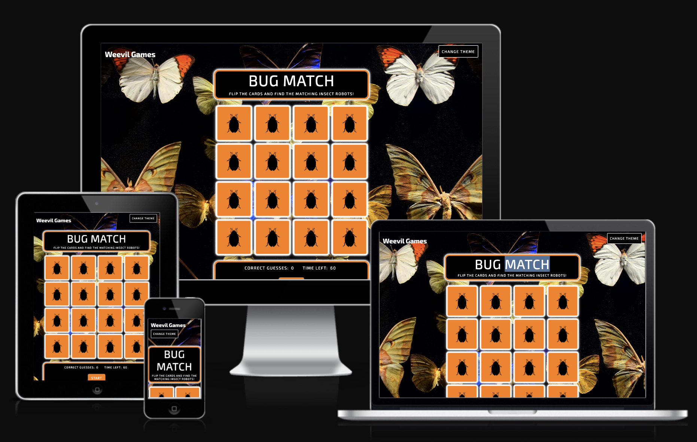
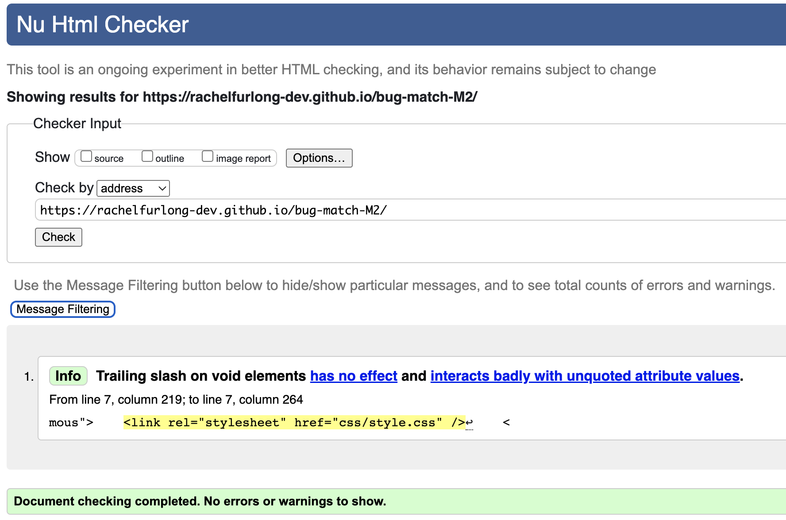
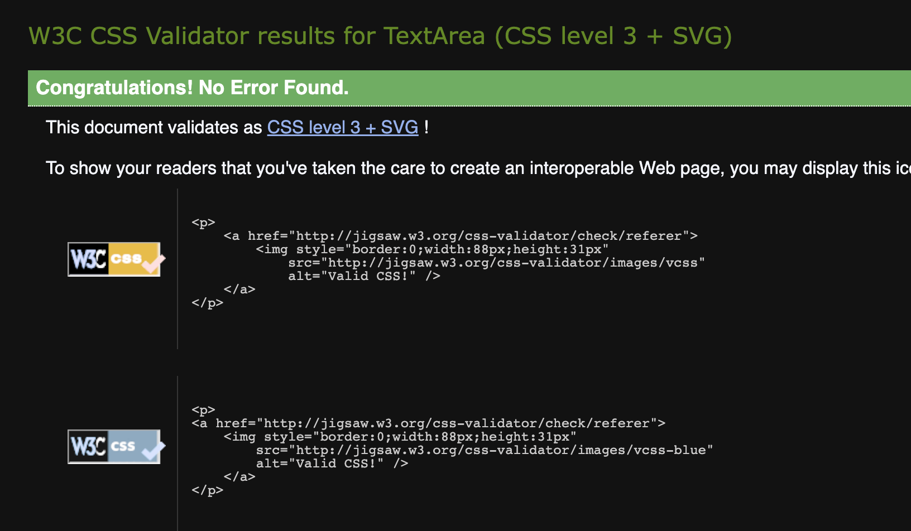
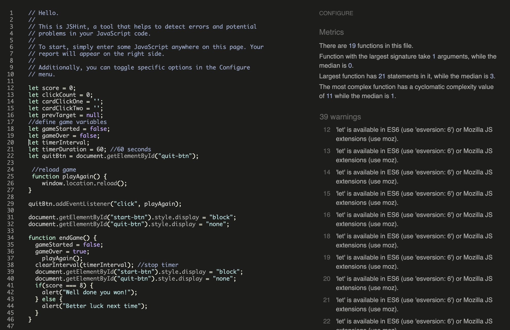
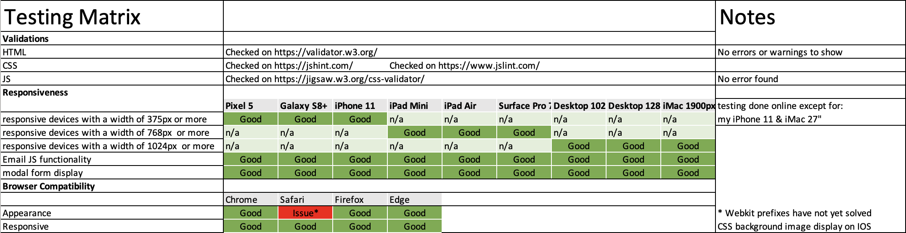
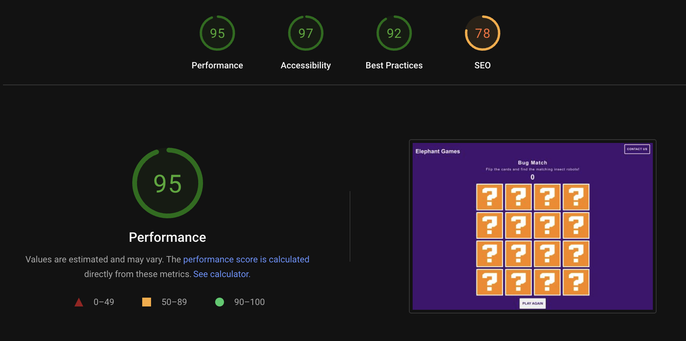

<h1 align="center">Bug Match</h1>

[View the live project here.](https://rachelfurlong-dev.github.io/bug-match-M2/)

This is a memory game for my Milestone 2 project by a fictional company called Elephant Games, designed as part of a series of memory games to be added to the site in different formats. The main target users are parents and their child, to help children develop working memory skills in an enjoyable way and have fun. (Child age range: 4 – 9years.)

<h2 align="center"></h2>

### User Stories:

"**_As a user, I would like to find a memory game_** _______________"

:white_check_mark: *successfully implemented*

:x: *not yet implemented*

- :white_check_mark: *my child enjoys using and to have fun*.
- :white_check_mark: *which are at the same time visually engaging and educational*.
- :white_check_mark: *that develops my child's memory and concentration skills*.
- :white_check_mark: *which counts the score of the matches my child gets right*.
- :white_check_mark: *which allows my child to reset the game*.
- :white_check_mark:: *which challenges my child with a timer to compete against*.
- :white_check_mark: *where I can contact the creators about future games 
available*.
- :white_check_mark: *my child to be able to view the site* from **any device** *(mobile, tablet, desktop)*.
- :white_check_mark: *which randomises the order of the cards at each reset*.
- :x: *which  has additional levels and increases the number of cards to match*.
- :x: *which rewards success as my child improves at the game*.

## Design:

#### Typography
 The Exo 2 font, a geometric sans serif font with a technological feel was selected via [Google Fonts:](https://fonts.google.com/) and is used throughout the website with sans serif as the fallback font in case for any reason the font cannot be displayed in a browser correctly.

### Color Scheme:

*Palette*: **Flip Card Memory Game**

| Cards | Background |
| :---: | :---: |
|  |  |
| #FF7F00 | #000 |  

### Imagery:
[Stable Diffusion](https://stablediffusionweb.com/) generated the insect robots to which I added bright colour backgrounds to make the cards easier to identify.

### Wireframes
My wireframes were created in Adobe XD as I am familiar with Adobe products and can therefore work more quickly.

Mobile 

Small-Screen 

Desktop Wireframe 

### Features

-   A board of 16 cards where a maximum of 2 cards at a time can be flipped when clicking on the card, which flip back if they do not match.
-   If two selected cards match, to flip cards back and & which cannot be reselected.
-   A score button to increment when there is a match.
-   Ability to reset the game.
-   Ability to message Elephant Games about future game development.
-   Work on desktop and mobile screens across browsers.
-   A randomised display of cards at start.
-   Ability for the user to change the background to select different themes.
-   A 404 page for users who direct to a non-existent page or resource are redirected back to the main page without having to use browser navigation buttons.

### Additional features to be implemented

-  Add a score button when cards do not match.
-  Add rewards for successful games completed.

## Technologies Used

### Languages Used

-   [HTML5](https://en.wikipedia.org/wiki/HTML5)
-   [CSS3](https://en.wikipedia.org/wiki/Cascading_Style_Sheets)
-   [JavaScript](https://en.wikipedia.org/wiki/Cascading_Style_Sheets)


### Frameworks, Libraries & Programs Used

1. [Bootstrap 4.6.2:](https://getbootstrap.com/docs/4.6/getting-started/introduction/)
    - Bootstrap was used to assist with the responsiveness navigation and modal functionality.
2. [Google Fonts:](https://fonts.google.com/)
    - Google fonts were used to import the 'Roboto' font into the style.css file.
3. [jQuery:](https://jquery.com/)
    - jQuery came with Bootstrap to make the navbar responsive but was also used for modal functionality.
4. [Git](https://git-scm.com/)
    - Git was used for version control by utilizing the Gitpod terminal to commit to Git and Push to GitHub.
5. [GitHub:](https://github.com/)
    - GitHub is used to store the projects code after being pushed from Git.
6. [GitPod:](https://github.com/)
    - GitHPod was used as the online code editor.
7. [Photoshop:](https://www.adobe.com/ie/products/photoshop.html)
    - Photoshop was used to create the logo, resizing images and editing photos for the website.
8. [Illustrator:](https://www.adobe.com/ie/products/illustrator.html)
    - Illustrator was used to create the favicon and question mark images for the website.
9. [XD:](https://www.adobe.com/ie/products/xd.html)
    - XD was used to create the [wireframes](/docs/wireframes/) during the design process.
10. [Stable Diffusion:](https://stablediffusionweb.com/)
    - XD was used to generate the Robot Insect images as part of the design process.
11. [Jest:](https://jestjs.io/)
    - Jest is a JavaScript testing framework built on top of Jasmine and maintained by Meta.
12. [EmailJS:](https://www.emailjs.com/)
    -  Allows sending email directly from Javascript, with no backend development.
13. [Autoprefixer CSS Online:](https://autoprefixer.github.io/)
    -  A PostCSS plugin which parses CSS and adds vendor prefixes.   

## Testing

### Automated testing (TDD)
We can use code to test our code. which has several advantages over the manual testing method. Many hundreds of tests can be run against a project in a short space of time, and as tests are usually written by the  programmer during development, errors are picked up early. 

However, tests are only as good as the questions we ask & tests can end up as purely decorative giving a false impression. Automated tests don't test the User Experience either, so the best testing strategy is a combination of both automated and user tests. 

### Jest
I have used the Jest JavaScript Testing Framework to develop automated test for the Bug Match game. Test-Driven development is to develop code incrementally in the following way: write tests that we know will fail and then, we write just enough code to get the test to pass - without breaking any previous tests. Finally, to think about ways that we can improve or refactor our code.  This cycle is known as Red-Green-Refactor. Finally a suite of tests can be run for complete app, by typing one command into the terminal -  npm test.

I have used Jest as an introduction to automated testing to test code already written. The next stage in my development will be to implement this testing process as the product is being built.

### Requirements:
Before running the tests, a modification is required in script.js: comment out the EmailJS & modal scripts as well as line 15 appending the squares container to the DOM. 

### Testing the Array of Objects 
Checks if an array of objects: 
1. contains a specific value.

2. contains a specific object.


### Testing the number of specific elements contained within an html page 
1. h3 should exist.
2. three buttons should exist.


## Manual testing (BDD)
Behaviour-Driven development is based on  the expected outcome of an action, to see if an app behaves as expected. BDD builds on the user stories, extending this by adding Given, Then, and When  - so given (a specific context), when (a specific action is carried out), then (a particular set of observable consequences should occur). The behaviour is now testable, and repeatable.
 
## BDD example with Bug Match
As a user, when I arrive at the webpage. 
- I want to be able to click a maximum of two squares, so that each square flips and displays an image.
- I want the flipped squares if they don’t match to be flipped back in the game so I can have another go.
- I want the flipped squares if they do match to be flipped back and disabled, and be counted as a match on the scoreboard.

## Testing User Stories
"**_As a visiting user, I would like to_** _______________"

- play a memory game that is visually engaging and educational:
I have created a set of insect robot images designed to make the game appealing and fun for children to use. The images can be viewed in the folder [here](/assets/img/).

- easily understand how to play the game:
Instructions on how to play the game are included above the grid of images.


- see progress:
The scoreboard rewards the user with a point every time there is a match.


- reset the game at any point:
The game has a reset button to allow the user to restart the game from the beginning at any point during the game.The reset button will only appear once the game has started and the game is in progress.

- as a parent, observe that the game develops my child's focus and concentration skills:
The game displayes the images in a random order each time so the child cannot predict where the matching images are. The user gets 60 seconds to complete the game and receive a 'Success' message if completed in time or a 'Try again' message if not. The game can be easily reset to have another go.

- as a parent connect with the game developer via email:
Users can click the Get in Touch link in the footer to access the contact form. The contact form utilises the JavaScript library, EmailJS. EmailJS is a JavaScript library that helps send emails using only client-side technologies, enabling a connection to a chosen email service (Gmail is used in this project), build an email template, and send without any server code. The input fields are required and the users are prompted to fill them if any input field is left empty. When the user has sent the form, they receive a pop-up message to reasure them the email has been sent and the developer will reply soon.


## Example message received using template fields in Email JS


## Code Validation
### HTML validation



### CSS Validation


### JS Validation
Metrics:
There are 19 functions in this file.
Function with the largest signature take 1 arguments, while the median is 0.
Largest function has 21 statements in it, while the median is 3.
The most complex function has a cyclomatic complexity value of 11 while the median is 1.



### Browser testing
-   The Website was tested on Google Chrome, Mozilla Firefox, Microsoft Edge and Safari browsers.
-   The website was viewed on a variety of devices such as Desktop, Laptop & Mobile. Testing was done online except for my iPhone 11 and iMac 27". I used webkit prefixes to try and solve the issues in IOS which mean the background css images do not show. However, more research needs to be done.



Responsive views of the project can be seen in the testing folder [here](docs/manual-testing/responsive-views/)

### Performance
I checked the webpage for performance, accessibility, best practices and SEO, on desktop and mobile layouts, with an overall score of 95 for performance.



## Known Bugs
-   On IOS the background CSS images are not showing. I used [Autoprefixer](https://autoprefixer.github.io/) to add vendor prefixes although the issue remains to be solved.
-   When using Jest, the test environment won't run unless Line 10 & the modal is commented out. I researched this [here](https://github.com/reactjs/react-modal/issues/71) which indicates there could be an issue relating to the DOM.


## Deployment

### GitHub Pages

The project was deployed to GitHub Pages using the following steps...

1. Log in to GitHub and locate the [GitHub Repository](https://github.com/)
2. At the top of the Repository (not top of page), locate the "Settings" Button on the menu.
    - Alternatively Click [Here](https://raw.githubusercontent.com/) for a GIF demonstrating the process starting from Step 2.
3. Scroll down the Settings page until you locate the "GitHub Pages" Section.
4. Under "Source", click the dropdown called "None" and select "Master Branch".
5. The page will automatically refresh.
6. Scroll back down through the page to locate the now published site [link](https://github.com) in the "GitHub Pages" section.

### Forking the GitHub Repository

By forking the GitHub Repository we make a copy of the original repository on our GitHub account to view and/or make changes without affecting the original repository by using the following steps...

1. Log in to GitHub and locate the [GitHub Repository](https://github.com/)
2. At the top of the Repository (not top of page) just above the "Settings" Button on the menu, locate the "Fork" Button.
3. You should now have a copy of the original repository in your GitHub account.

### Making a Local Clone

1. Log in to GitHub and locate the [GitHub Repository](https://github.com/)
2. Under the repository name, click "Clone or download".
3. To clone the repository using HTTPS, under "Clone with HTTPS", copy the link.
4. Open Git Bash
5. Change the current working directory to the location where you want the cloned directory to be made.
6. Type `git clone`, and then paste the URL you copied in Step 3.

```
$ git clone https://github.com/YOUR-USERNAME/YOUR-REPOSITORY
```

7. Press Enter. Your local clone will be created.

```
$ git clone https://github.com/YOUR-USERNAME/YOUR-REPOSITORY
> Cloning into `CI-Clone`...
> remote: Counting objects: 10, done.
> remote: Compressing objects: 100% (8/8), done.
> remove: Total 10 (delta 1), reused 10 (delta 1)
> Unpacking objects: 100% (10/10), done.
```

Click [Here](https://help.github.com/en/github/creating-cloning-and-archiving-repositories/cloning-a-repository#cloning-a-repository-to-github-desktop) to retrieve pictures for some of the buttons and more detailed explanations of the above process.

## Credits

### Code

-   Memory Game process research [Tania Rascia](https://www.taniarascia.com/how-to-create-a-memory-game-super-mario-with-plain-javascript/)

-   Memory game process research [Chris Dixon](https://www.skillshare.com/en/classes/JavaScript-Fun-Build-a-Memory-Game/816661364/classroom/discussions) 

-   Memory Game process research [Ferenc Almasi](https://webtips.dev/memory-game-in-javascript?utm_content=cmp-true)

-   Explanation of storing a variable so it can't be clicked twice [Stack Overflow](https://stackoverflow.com/questions/72204486/how-to-store-previous-event-currenttarget-in-a-variable)

-   Chat GPT for process linking BootStrap modal contact form to Email JS [Chat GPT](https://openai.com/blog/chatgpt)

-   [Bootstrap4](https://getbootstrap.com/docs/4.4/getting-started/introduction/): Bootstrap Library used throughout the project mainly to make site responsive using the Bootstrap Grid System.

-   [MDN Web Docs](https://developer.mozilla.org/) : For Pattern Validation code. Code was modified to better fit my needs and to match an Irish phone number layout to ensure correct validation. Tutorial Found [Here](https://developer.mozilla.org/en-US/docs/Web/HTML/Element/input/tel#Pattern_validation)

### Acknowledgements

-   My mentor Tim Nelson for continuous helpful feedback.

-   Tutor support at Code Institute for their support.
